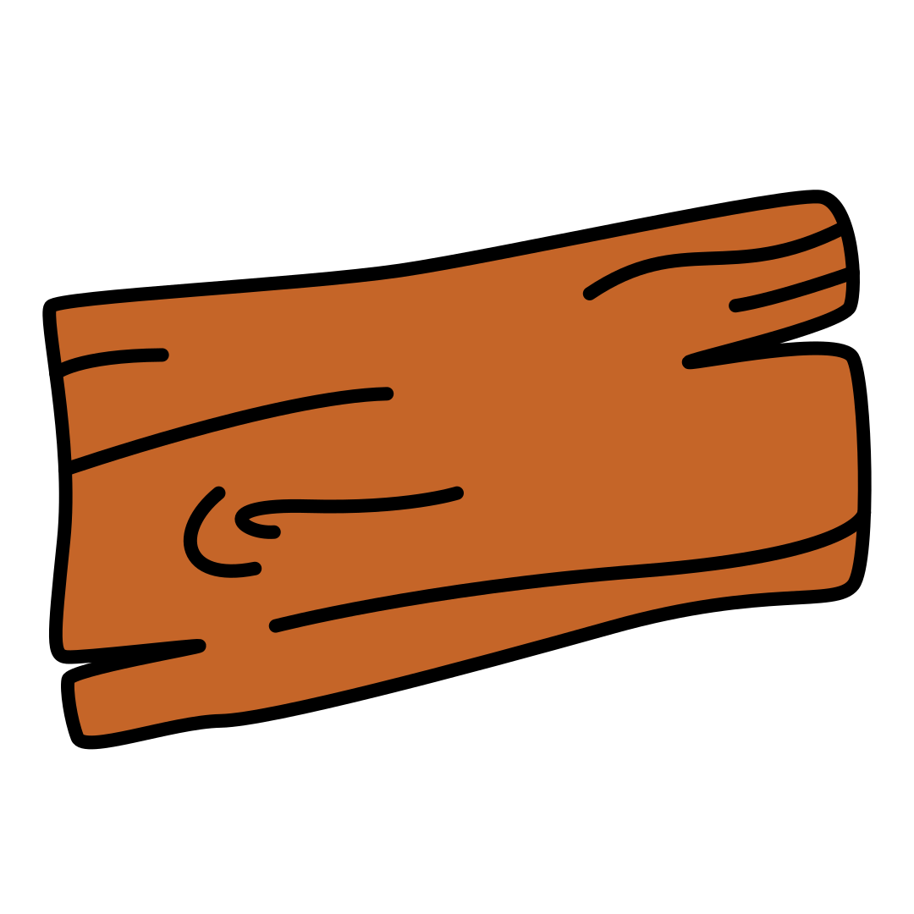

> This is a port of [driver.js](https://github.com/kamranahmedse/driver.js).  
> It uses a different highlight technique under the hood, which does not fiddle with z-index.  
> This ensures the layout will always stay intact. With driver.js this is not the case

<h1 align="center"><br> Boarding.js</h1>

<p align="center">
  <a href="https://github.com/josias-r/boarding.js/blob/master/license">
    
  </a>
  <a href="https://npmjs.org/package/boarding.js">
    
  </a>
  <a href="https://npmjs.org/package/boarding.js">
    
  </a>
</p>

<p align="center">
  <b>Powerful, highly customizable vanilla JavaScript engine to on<i>board</i> the user's focus across the page</b></br>
  <sub>No external dependencies, supports all major browsers and highly customizable <sub>
</p>

<br />

- **Simple**: is simple to use and has no external dependency at all
- **Highly customizable**: has a powerful API and can be used however you want
- **Highlight anything**: highlight any (literally any) element on page
- **Feature introductions**: create powerful feature introductions for your web applications
- **Focus shifters**: add focus shifters for users
- **User friendly**: Everything is controllable by keyboard
- **Consistent behavior**: usable across all major browsers
- **MIT Licensed**: free for personal and commercial use


For Usage and Examples, [have a look at demo](https://josias-r.github.io/boarding.js/)

## So, yet another tour library?

**No**, it is not. **Tours are just one of the many use-cases**. Boarding.js can be used wherever you need some sort of overlay for the page; some common use cases could be: e.g. dimming the background when the user is interacting with some component, using it as a focus shifter to bring the user's attention to some component on a page (i.e. for a new feature introduction ✨), or using it to simulate those "Turn off the Lights 💡" widgets that you might have seen on video players online, etc.

Boarding.js is written in Vanilla JS (with TypeScript), has zero dependencies and is highly customizable. It has several options allowing you to manipulate how it behaves and also **provides you the hooks** to manipulate the elements as they are highlighted, about to be highlighted, or deselected.

## Installation

You can install it using `yarn` or `npm`, whatever you prefer.

```bash
yarn add boarding.js
npm install boarding.js
```

Or include it using CDN. If you want a specific version, put it as `boarding.js@1.3.0` in the name

```html
<script src="https://unpkg.com/boarding.js/dist/main.js"></script>
<link rel="stylesheet" href="https://unpkg.com/boarding.js/styles/main.css" />
<link
  rel="stylesheet"
  href="https://unpkg.com/boarding.js/styles/themes/basic.css"
/>
```


## Usage and Demo

If you are using some sort of module bundler, import the library and the CSS file

```javascript
import { Boarding } from "boarding.js";
import "boarding.js/styles/main.css";
```

otherwise use the `script` and `link` tags to import the JavaScript and CSS files.

Demos and many more usage examples can be found [in the docs page](https://josias-r.github.io/boarding.js).

### Highlighting Single Element – [Demo](https://josias-r.github.io/boarding.js#single-element-no-popover)

You can highlight a single element by simply passing the selector.

```javascript
const boarding = new Boarding();
boarding.highlight("#create-post");
```

A real-world usage example for this is: using it to dim the background and highlight the required element e.g. when you want to introduce a new feature

### Highlight and Popover – [Demo](https://josias-r.github.io/boarding.js#single-element-with-popover)

You can show additional details beside the highlighted element using the popover.

```javascript
const boarding = new Boarding();
boarding.highlight({
  element: "#some-element",
  popover: {
    title: "Title for the Popover",
    description: "Description for it",
  },
});
```

Also, `title` and `description` can have HTML as well.

### Positioning the Popover – [Demo](https://josias-r.github.io/boarding.js#single-element-with-popover-position)

By default, boarding automatically finds the suitable position for the popover and displays it. You can override it using `prefferedSide` and the `alignment` property.

```javascript
const boarding = new Boarding();
boarding.highlight({
  element: "#some-element",
  popover: {
    title: "Title for the Popover",
    description: "Description for it",
    // prefferedSide can be left, right, top, bottom
    prefferedSide: "left",
    // alignment can be start, center, right
    alignment: "center",
  },
});
```

You can also add offset to the popover position by using the `offset` property

```javascript
const boarding = new Boarding();
boarding.highlight({
  element: "#some-element",
  popover: {
    title: "Title for the Popover",
    description: "Description for it",
    // Will show it 20 pixels away from the actual position of popover
    // You may also provide the negative values
    offset: 20,
  },
});
```

### Creating Feature Introductions – [Demo](https://josias-r.github.io/boarding.js)

Feature introductions are helpful when onboarding new users and giving them an idea about different parts of the application; you can create them seamlessly with Boarding. Define the steps and call the `start` when you want to start presenting. Users will be able to control the steps using the keyboard or using the buttons on popovers.

```javascript
const boarding = new Boarding();

// Define the steps for introduction
boarding.defineSteps([
  {
    element: "#first-element-introduction",
    popover: {
      className: "first-step-popover-class",
      title: "Title on Popover",
      description: "Body of the popover",
      prefferedSide: "left",
    },
  },
  {
    element: "#second-element-introduction",
    popover: {
      title: "Title on Popover",
      description: "Body of the popover",
      prefferedSide: "top",
    },
  },
  {
    element: "#third-element-introduction",
    popover: {
      title: "Title on Popover",
      description: "Body of the popover",
      prefferedSide: "right",
    },
  },
]);

// Start the introduction
boarding.start();
```

You can also hide the buttons and control the introductions programmatically by using the API methods listed below.


### Asynchronous Actions – [Demo](https://josias-r.github.io/boarding.js)

For any asynchronous actions between the transition steps, you may delay the execution till the action completes. All you have to do is stop the transition using `boarding.preventMove()` in your `onNext` or `onPrevious` callbacks and then use `boarding.continue()` to continue the transition where you left off. Here is a sample implementation where it will stop at the second step for four seconds and then move on to the next step.

```javascript
const boarding = new Boarding();

// Define the steps for introduction
boarding.defineSteps([
  {
    element: "#first-element-introduction",
    popover: {
      title: "Title on Popover",
      description: "Body of the popover",
      prefferedSide: "left",
    },
  },
  {
    element: "#second-element-introduction",
    popover: {
      title: "Title on Popover",
      description: "Body of the popover",
      prefferedSide: "top",
    },
    onNext: () => {
      // Prevent moving to the next step
      boarding.preventMove();

      // Perform some action or create the element to move to
      // And then move to that element
      setTimeout(() => {
        boarding.continue();
      }, 4000);
    },
  },
  {
    element: "#third-element-introduction",
    popover: {
      title: "Title on Popover",
      description: "Body of the popover",
      prefferedSide: "right",
    },
  },
]);

// Start the introduction
boarding.start();
```

You can also hide the buttons and control the introductions programmatically by using the API methods listed below.


## API

Boarding comes with several options that you can manipulate to make Boarding behave as you like

### Boarding Definition

Here are the options that Boarding understands:

```javascript
const boarding = new Boarding({
  className: "scoped-class", // className to wrap boarding.js popover
  animate: true, // Whether to animate or not
  opacity: 0.75, // Background opacity (0 means only popovers and without overlay)
  padding: 10, // Distance of element from around the edges
  allowClose: true, // Whether the click on overlay should close or not
  overlayClickNext: false, // Whether the click on overlay should move next
  doneBtnText: "Done", // Text on the final button
  closeBtnText: "Close", // Text on the close button for this step
  nextBtnText: "Next", // Next button text for this step
  prevBtnText: "Previous", // Previous button text for this step
  showButtons: false, // Do not show control buttons in footer
  keyboardControl: true, // Allow controlling through keyboard (escape to close, arrow keys to move)
  scrollIntoViewOptions: {}, // We use `scrollIntoView()` when possible, pass here the options for it if you want any
  onBeforeHighlighted: (HighlightElement) => {}, // Called when element is about to be highlighted
  onHighlighted: (HighlightElement) => {}, // Called when element is fully highlighted
  onDeselected: (HighlightElement) => {}, // Called when element has been deselected
  onReset: (HighlightElement) => {}, // Called when overlay is about to be cleared
  onNext: (HighlightElement) => {}, // Called when moving to next step on any step
  onPrevious: (HighlightElement) => {}, // Called when moving to previous step on any step
  strictClickHandling: true, // Can also be `"block-all"` or if not wanted at all, `false`. Either block ALL pointer events, or isolate pointer-events to only allow on the highlighted element (`true`). Popover and overlay pointer-events are of course always allowed to be clicked
});
```

Note that all the button options that you provide in the boarding definition can be overridden for a specific step by giving them in the step definition

### Step Definition

Here is the set of options that you can pass while defining steps `defineSteps` or the object that you pass to `highlight` method:

```javascript
const stepDefinition = {
  element: "#some-item", // Query selector string or Node to be highlighted
  popover: {
    // There will be no popover if empty or not given
    className: "popover-class", // className to wrap this specific step popover in addition to the general className in Boarding options
    title: "Title", // Title on the popover
    description: "Description", // Body of the popover
    showButtons: false, // Do not show control buttons in footer
    doneBtnText: "Done", // Text on the last button
    closeBtnText: "Close", // Text on the close button
    nextBtnText: "Next", // Next button text
    prevBtnText: "Previous", // Previous button text
    preferredSide: "top", // Preffered side on which the popover should render of the HighlightElement
    alignment: "start", // Alignment of the popover on the side it gets renderd on
  },
  onNext: () => {}, // Called when moving to next step from current step
  onPrevious: () => {}, // Called when moving to previous step from current step
};
```

For example, here is how it would look when highlighting a single element:

```javascript
const boarding = new Boarding(boardingOptions);
boarding.highlight(stepDefinition);
```

And this is how it would look when creating a step-by-step guide:

```javascript
const boarding = new Boarding(boardingOptions);
boarding.defineSteps([
  stepDefinition1,
  stepDefinition2,
  stepDefinition3,
  stepDefinition4,
]);
```

### API Methods

Below is the set of available methods:

```javascript
const boarding = new Boarding(boardingOptions);

// Checks if the boarding is active or not
if (boarding.isActivated) {
  console.log("Boarding is active");
}

// In case of the steps guide, you can call below methods
boarding.defineSteps([stepDefinition1, stepDefinition2, stepDefinition3]);
boarding.start((stepNumber = 0)); // Starts driving through the defined steps
boarding.next(); // Moves to next step in the steps list
boarding.previous(); // Moves to previous step in the steps list
boarding.hasNextStep(); // Checks if there is next step to move to
boarding.hasPreviousStep(); // Checks if there is previous step to move to

// Prevents the current move. Useful in `onNext` or `onPrevious` if you want to
// perform some asynchronous task and manually move to next step
boarding.preventMove();
boarding.continue(); // Continue the move that was prevented using preventMove

// Highlights the element using query selector or the step definition
boarding.highlight(string | stepDefinition);

// Resets the overlay and clears the screen
boarding.reset();

// Additionally you can pass a boolean parameter
// to clear immediately and not do the animations etc
// Could be useful when you, let's say, want to run
// a different instance of boarding while one was running
// TODO: currently reset is always "immediate" since there is no out-animation
boarding.reset((clearImmediately = false));

// Checks if there is any highlighted element
if (boarding.hasHighlightedElement()) {
  console.log("There is an element highlighted");
}

// Gets the currently highlighted element on screen
// It would be an instance of `/src/core/highlight-element.ts`
const activeElement = boarding.getHighlightedElement();

// Gets the last highlighted element, would be an instance of `/src/core/highlight-element.ts`
const lastActiveElement = boarding.getLastHighlightedElement();
```


**Note –** Do not forget to add `e.stopPropagation()` to the `click` binding that triggers boarding.


## Contributions

Feel free to submit pull requests, create issues or spread the word.

## License

MIT &copy; [Josias Ribi](https://josias.me)
